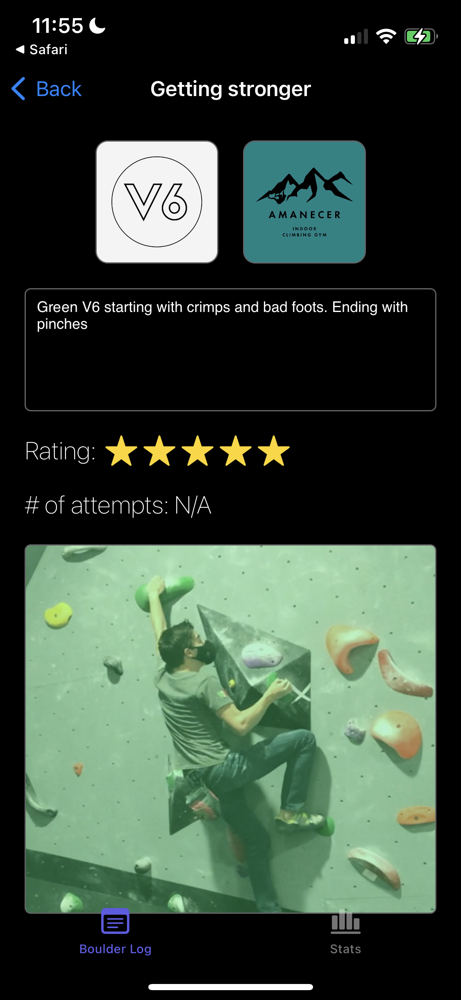

# BoulderLog
iOS app developed in Swift using UIKit framework doing all the UI Programmatically.

* App that will allow users to log any boulder they have climbed
* Users can view stats by location and by grade.
* Boulders can have, name, description, grade, rating, location and photo.

## Features
- Log boulders
- View stats by location
- View stats by grade
- Filter and search for specific boulders
- Rate boulders

## Screenshots

### Main Screen

### Add Beta

### View beta

### View stats

### Stats by gym

### Stats by grade

